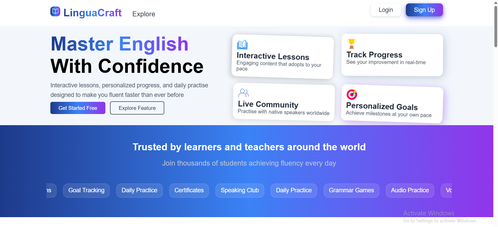
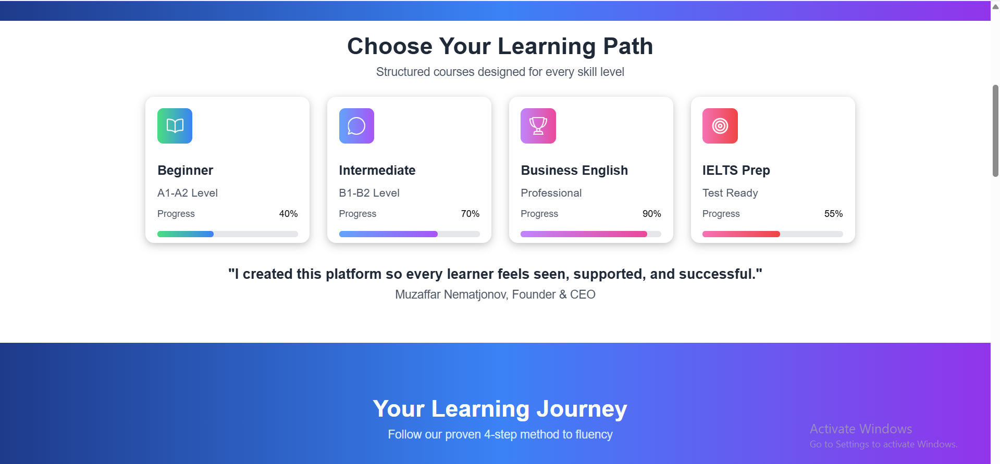
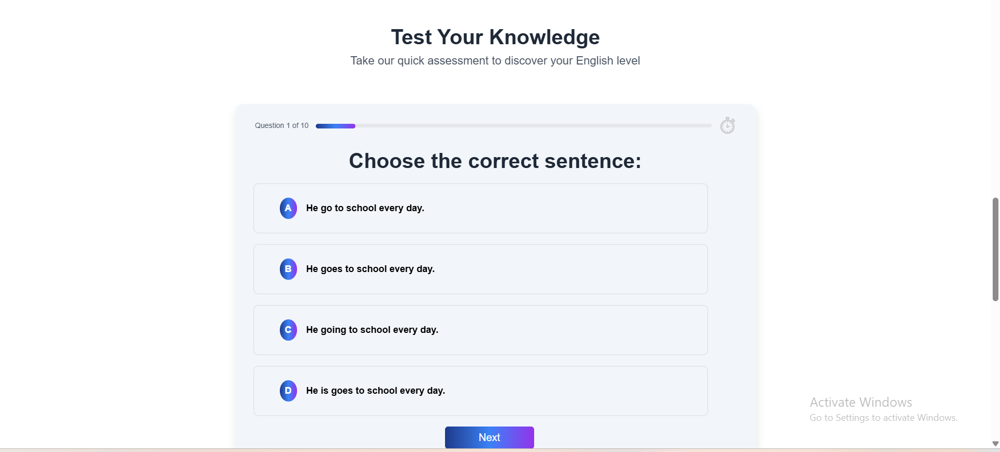
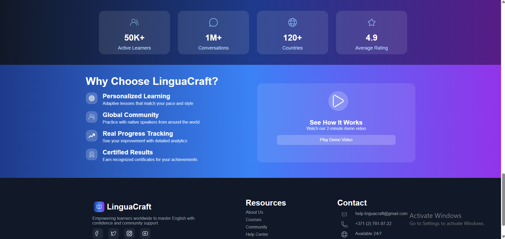
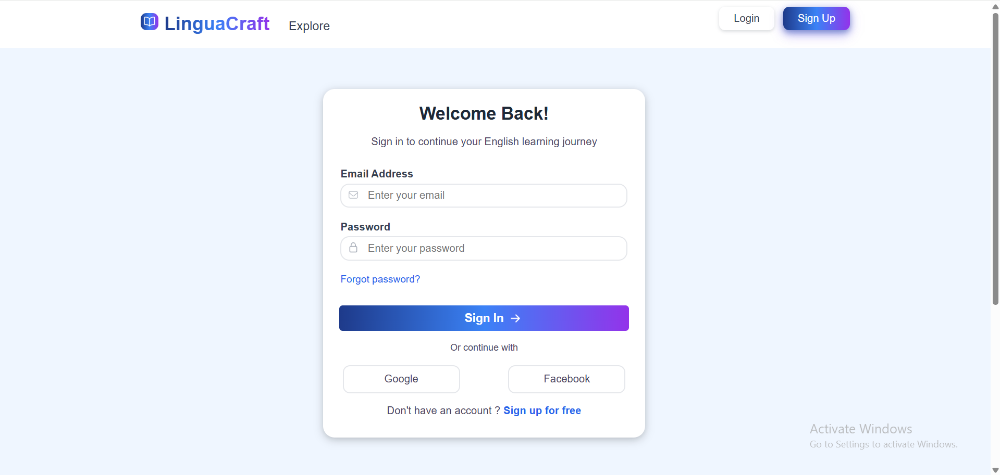
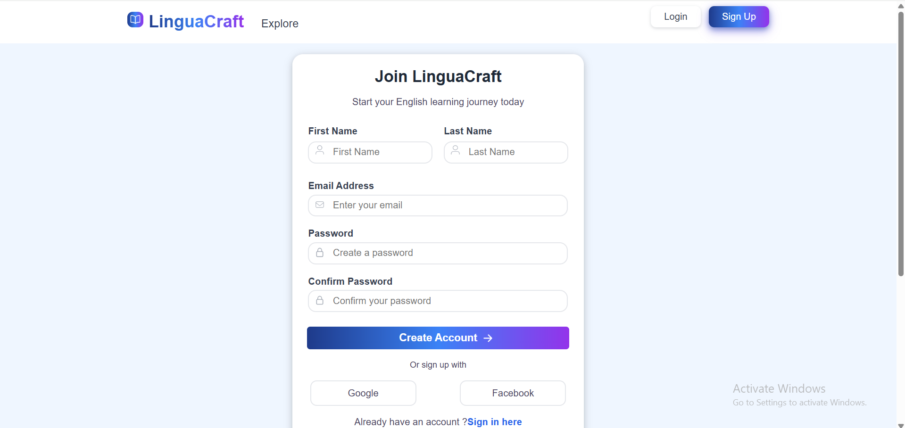
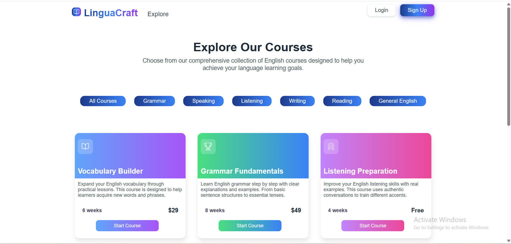
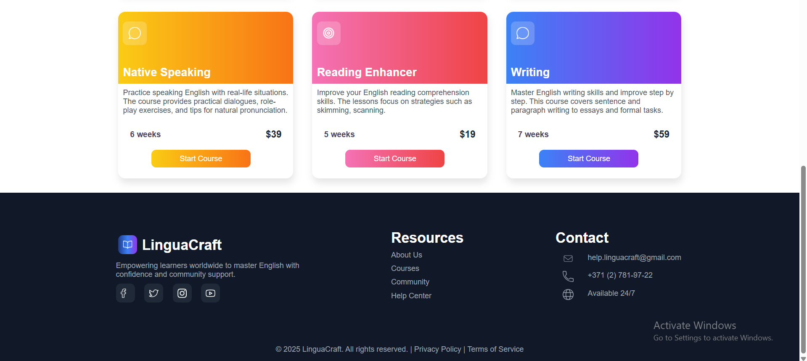

# 🎓 LinguaCraft — Interactive Online Learning Platform

**LinguaCraft** is a modern, responsive learning platform inspired by Coursera and Udemy.  
Users can browse courses, log in, enroll, and start learning through a clean and intuitive interface.  
Built with **React**, styled with **Custom CSS**, and powered by **Firebase Authentication & Realtime Database**.

---

## 🔗 Live Demo

👉https://linguacraft.vercel.app/

---

## 🚀 Technologies Used

- ⚛️ **React**
- 🎨 **Custom CSS (modular per-component styling)**
- 🔥 **Firebase Authentication**
- 🗄️ **Firebase Realtime Database**
- 📡 **Static JSON (local API simulation)**
- 🧭 **React Router**
- 🔧 **JavaScript (ES6+)**
- ⚙️ **Vite**
- ☁️ **Vercel Deployment**

---

## ⚡ Features

### 🔐 Authentication (Firebase)

- User signup
- User login

### 🔒 Protected Routes

- User must be logged in to access learning content
- If user is NOT logged in → **auto redirect to Login page**
- Enhances security and creates real-life ed-tech behavior

### 📚 Courses System

- Browse available courses
- View course details
- Start learning with **Start Course** button
- Prevents access if user is not authenticated
- Static JSON data simulates small backend API

### 🧠 Custom Hooks

- `useLogin`, `useSignup`, `useLogout`
- Firebase-integrated reusable logic
- Cleaner and more maintainable authentication flow

### 🧱 Component-Based Structure

Every component has:

- `Component.jsx`
- `Component.css`  
  Separated to keep code clean, readable, and scalable.

### 🏛️ Layout System

- Global layout (header + footer)
- Page-level switching handled through `<Outlet />`
- Consistent UI across the whole application

### 📱 Responsive UI

- Fully responsive design using custom CSS
- Works on:
  - Mobile
  - Tablet
  - Desktop

---

## 🏗️ Architecture Overview

- **Frontend:** React
- **Styling:** Component-level Custom CSS
- **Routing:** React Router (dynamic + protected routes)
- **Backend:** Firebase Realtime Database
- **Authentication:** Firebase Auth
- **Global State:** React Context API
- **Hooks:** Custom React hooks for authentication logic
- **Data Source:** `/public/data/*.json` (simulated API)
- **Deployment:** Vercel

---

## 📂 Project Structure

```txt
LinguaCraft/
│── public/
│   ├── assets/               # Images and media
│   ├── data/                 # Static JSON (mock backend API)
│   └── index.html
│
│── src/
│   ├── components/           # Reusable UI components (+ individual CSS files)
│   │   ├── Navbar/
│   │   ├── Footer/
│   │   ├── CourseCard/
│   │
│   │
│   ├── context/              # Global Context (authentication, user state)
│   │   └── AuthContext.jsx
│   │
│   ├── firebase/             # Firebase configuration files
│   │   └── config.js
│   │
│   ├── hooks/                # Custom hooks for auth & firebase operations
│   │   ├── useLogin.js
│   │   ├── useSignup.js
│   │   └── useLogout.js
│   │
│   ├── layout/               # Global layout (Header + Footer + Outlet)
│   │   └── MainLayout.jsx
│   │
│   ├── pages/                # All main pages (each split into multiple sections)
│   │   ├── About/
│   │   ├── Auth/
│   │   ├── Contact/
│   │   ├── Courses/
│   │
│   │
│   ├── App.jsx               # Main app component
│   └── main.jsx              # Entry point for React
│
├── .gitignore
├── package.json
├── package-lock.json
├── vite.config.js
└── README.md


📸 Screenshots


🏠 Homepage
<p align="center">
    
    
    
    
</p>

🔐 Authentication (Login / Signup)
<p align="center">
    
    
</p>

📚 Course List / Course Info
<p align="center">
    
    
</p>
```

🧑‍💻 Developer

Muzaffar Nematjonov
Junior Full-Stack Developer

GitHub: https://github.com/Muzaffarfullstack
Portfolio: https://vercel.com/muzaffars-projects-08394859
